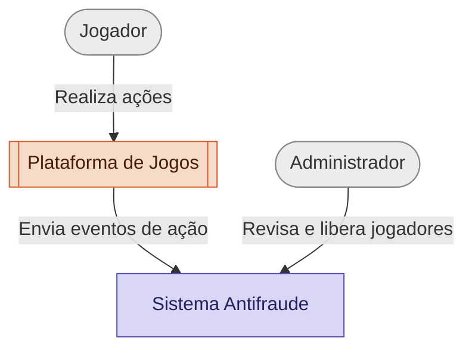
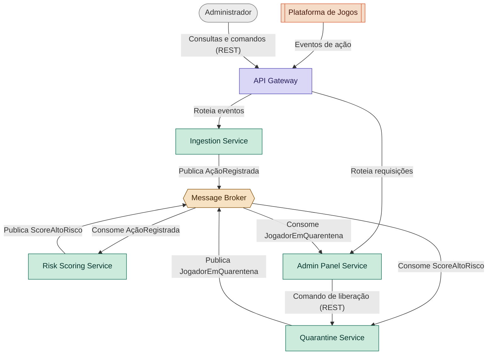

# POC 2 — Antifraude Mínimo Viável

Projeto Final de Engenharia de Sistemas Distribuídos (2026.1) — Documentação Inicial (Projeto 02).

## Sobre o Projeto

Uma plataforma de jogos gera, a cada ação do jogador, sinais que podem indicar comportamento fraudulento — bots, múltiplas contas, conluio coordenado ou uso simultâneo de múltiplos dispositivos.

O **Sistema Antifraude** analisa esses sinais em tempo real, calcula um **risk score multifatorial** (device fingerprint, velocidade de ação, padrão de escolhas, correlação entre contas) e aplica **quarentena automática** a jogadores suspeitos, com revisão humana disponível via Painel Admin.

O sistema é construído como um conjunto de microsserviços, aplicando padrões consagrados de arquitetura distribuída para lidar com escrita/leitura em alto volume, consistência entre serviços e resiliência a falhas.

---

## Arquitetura

### Diagrama C4 — Nível 1 (Contexto)



O Jogador não interage diretamente com o Sistema Antifraude — seus dados comportamentais, capturados pela Plataforma de Jogos, são o principal insumo analisado pelo motor de risk scoring.

### Diagrama C4 — Nível 2 (Containers)



| Microsserviço | Responsabilidade |
|---|---|
| **API Gateway** | Ponto único de entrada para requisições externas (Plataforma de Jogos e Administrador). Roteia cada requisição para o serviço interno correto |
| **Ingestion Service** | Recebe os eventos brutos de ação do jogador vindos da Plataforma de Jogos (cliques, escolhas, timestamps, device fingerprint) e os valida/normaliza antes de publicá-los internamente |
| **Risk Scoring Service** | Consome os eventos de ação, calcula o risk score multifatorial (device fingerprint + velocidade + padrão de escolhas + correlação entre contas) |
| **Quarantine Service** | Escuta scores de risco alto, aplica a quarentena automática com base no threshold configurado, e gerencia o ciclo de vida da quarentena (aplicar/liberar) |
| **Admin Panel Service** | Backend que serve o Painel Admin: expõe os casos suspeitos/em quarentena para revisão humana e envia comandos de liberação manual |
| **Message Broker** | Infraestrutura de mensageria (não é um microsserviço de negócio, é a peça que viabiliza a comunicação assíncrona entre os serviços acima) |

Cada microsserviço de domínio possui **seu próprio banco de dados** (Database-per-service).

---

## Padrões Arquiteturais Aplicados

| Padrão | Onde se aplica | Motivação |
|---|---|---|
| **Event Sourcing** | Risk Scoring Service, Ingestion Service e Quarantine Service | Guarda o histórico completo de eventos (não apenas o estado atual), possibilitando **auditoria total** de como cada score e cada decisão de quarentena foi alcançado — essencial para um sistema antifraude, que precisa justificar decisões perante um jogador que as conteste |
| **CQRS** | Risk Scoring Service | Separa o modelo de escrita (eventos brutos) do modelo de leitura (score pré-calculado), já que os dois têm padrões de acesso muito diferentes |
| **SAGA (Choreography)** | Risk Scoring → Quarantine → Admin Panel | Coordena a cadeia "score alto → aplicar quarentena → notificar "admin" através de eventos encadeados, sem necessidade de um orquestrador central dado o tamanho reduzido da cadeia |
| **Anti-corruption Layer** | Ingestion Service | Traduz o formato externo de eventos da Plataforma de Jogos para o modelo de domínio interno, isolando o sistema de mudanças no contrato externo |

---

## Decisões Arquiteturais (ADRs)

### ADR 001 — Escolha do Message Broker

**Status:** Aceito

**Contexto:** O Sistema Antifraude depende de comunicação assíncrona entre os microsserviços para propagar eventos (`AçãoRegistrada`, `ScoreAltoRisco`, `JogadorEmQuarentena`), seguindo o estilo de **SAGA via Choreography** adotado para coordenar a resposta a um caso de fraude. É necessária uma ferramenta de mensageria com suporte a publish/subscribe, simples de configurar via Docker Compose e sem exigir conhecimento prévio que o grupo não teria tempo hábil de adquirir durante o projeto.

**Decisão:** RabbitMQ como message broker para toda a comunicação assíncrona entre os microsserviços.

**Alternativas consideradas:**
- *Kafka* — mais robusto para altíssimo volume e retenção longa de eventos (o que combinaria bem com Event Sourcing), mas descartado por exigir uma curva de configuração e operação desproporcional ao escopo de uma POC acadêmica.
- *Redis Pub/Sub* — mais leve, porém sem garantia de entrega (mensagens publicadas sem consumidor conectado são perdidas), inaceitável para eventos críticos como a aplicação de quarentena.

**Consequências:**
- Não oferece replay de eventos de longo prazo nativamente como o Kafka — se necessário, isso dependeria do Event Store (PostgreSQL), não do broker.

---

### ADR 002 — Persistência de Dados por Microsserviço

**Status:** Aceito

**Contexto:** Cada microsserviço precisa de armazenamento próprio (Database-per-service). É preciso decidir se cada serviço usa uma tecnologia de banco diferente (polyglot persistence) ou se o grupo padroniza uma única tecnologia. Além disso, o Risk Scoring Service, Ingestion Service e Quarantine Service adotam **Event Sourcing** — o histórico de eventos é a fonte da verdade, não apenas o estado atual — justamente para permitir **auditoria completa** de como cada score e cada decisão de quarentena foram calculados, um requisito importante em qualquer sistema antifraude que precise justificar suas decisões.

**Decisão:** PostgreSQL como banco de dados em todos os microsserviços (leitura e escrita), com uma instância própria por serviço — nunca compartilhada entre eles.

**Alternativas consideradas:**
- *Polyglot persistence completo* (uma tecnologia diferente por serviço) — descartado nesta fase; aumentaria a curva de aprendizado do grupo sem benefício proporcional ao escopo da POC. Fica registrado como possível evolução futura (ex.: Redis como modelo de leitura do CQRS).

**Consequências:**
- Um único conjunto de conhecimento (SQL/PostgreSQL) cobre todo o sistema, facilitando a colaboração entre os desenvolvedores, mesmo trabalhando em diferentes microsserviços.

---

### ADR 003 — Base de Dados para Entrada de Dados

**Status:** Aceito

**Contexto:** Precisamos de dados que sirvam de entrada para o Sistema Antifraude. Esses dados são enviados pela Plataforma de Jogos. Sendo assim, a escolha do banco de dados é de extrema importância, pois sua escolha definirá o contexto no qual o sistema irá trabalhar, impactando de forma direta e em especial o Risk Scoring Service. A escolha de uma boa base de dados é essencial para que o time possa focar no desenho de uma boa arquitetura e desenvolvimento dos microsserviços, sem se preocupar com problemas relacionados à base de dados, como normalização de dados, filtragem de um número grande de colunas, remoção de linhas duplicadas ou com pouca informação, entre outros.

**Decisão:** Escolhemos a base de dados [Synthetic Financial Datasets For Fraud Detection](https://www.kaggle.com/datasets/ealaxi/paysim1?select=PS_20174392719_1491204439457_log.csv), que é uma base de dados sintética, mas que simula de forma realista transações financeiras, com um grande número de colunas e linhas. A base de dados foi escolhida por ser de fácil acesso, por ser gratuita e por ser de fácil manipulação, além de ter uma relação direta com o contexto do projeto, que é a detecção de fraudes.

**Alternativas consideradas:**
- *Base com dados do jogo PUBG* - a base, que se encontra [aqui](https://www.kaggle.com/code/atharvparbalkar/cheater-detection-pubg/input?select=train_V2.csv), apesar de ter muitos dados e colunas com fácil interpretação, foi descartada por não ter uma relação direta com o contexto do projeto. Dessa forma, provavelmente o grupo gastaria um tempo significativa para transformá-la em algo que fosse mais útil ao nosso objetivo e escopo.

**Consequências:**
- Temos uma base de dados que simula de forma realista transações financeiras, com um grande número e linhas e atributos simples, que nos permite focar no desenho de uma boa arquitetura e desenvolvimento dos microsserviços, sem se preocupar com problemas relacionados à base de dados.

---

## Stack Tecnológico

| Camada | Escolha | Justificativa |
|---|---|---|
| **Linguagem / Framework** | Python + FastAPI | Assíncrono nativo, gera documentação OpenAPI automaticamente, curva de aprendizado baixa |
| **Banco de Dados** (leitura e escrita) | PostgreSQL | Ver [ADR 002](#adr-002--persistência-de-dados-por-microsserviço) |
| **Message Broker** | RabbitMQ | Ver [ADR 001](#adr-001--escolha-do-message-broker) |
| **Orquestração local** | Docker Compose | Sobe todos os microsserviços, bancos e broker com um único comando |
| **CI** | GitHub Actions | Lint, testes e build da imagem Docker a cada push/PR, nativo do GitHub |

---

## Ferramentas de IA Utilizadas

| Ferramenta | Onde atuou | Como foi orientada | Avaliação honesta |
|---|---|---|---|
| Claude (Anthropic) | Discussão de arquitetura, diagramas C4, redação de ADRs, montagem dos slides de apresentação | Perguntas incrementais do grupo sobre cada padrão/decisão, com contexto do documento do professor fornecido | Muito útil para aprender o conteúdo, mas é necessário utilizar _esforço de raciocínio_ nível _Médio_ ou maior, além de iterar continuamente, pois normalmente detalhes importantes para o entendimento e motivação dos padrões e diagramas ficam de fora na primeira iteração |
| Claude (Anthropic) | Criação da primeira versão dos slides de apresentação | Dividir os slides em ordem lógica para facilitar a apresentação, além de dividir as partes que cada integrante deveria apresentar e quanto tempo utilizar em cada uma | Também muito útil, pois os slides são organizados, consisos e abordam o conteúdo necessário. Porém, é melhor usá-lo apenas para gerar a primeira versão, pois essa funcionalidade consome muito recurso, reduzindo o crédito para consultas posteriores |
| Claude (Anthropic) | Escrita de documentação | Escrever os documentos, à exemplo deste README, seguindo as diretrizes especificadas, como: ordem das seções, nível de detalhamento, conformidade com o projeto | Muito útil para criar documentação coerente e bem estruturada. Contudo, à medida que as modificações em partes do projeto são decididas e feitas manualmente, fora do escopo da ferramenta, inconsistências vão sendo introduzidas, necessitando constante atualização da ferramenta para mitigar esses erros, além de sempre revisar cuidadosamente o conteúdo gerado |
| GitHub Copilot | Implementação da camada de CI básica | Propor e estruturar um workflow inicial no GitHub Actions para validar o projeto com lint, testes automatizados e build das imagens Docker em cada push/PR | Foi muito boa para acelerar a automação do fluxo de qualidade do repositório, especialmente em um projeto com múltiplos serviços, mas ainda será preciso revisar os passos a medida que o projeto evolui, a fim de garantir que ela esteja funcional para o contexto real do ambiente e do projeto |

---

## Como Executar

```bash
docker compose up --build
```

*(seção a ser completada conforme o setup do ambiente for finalizado pelo grupo)*