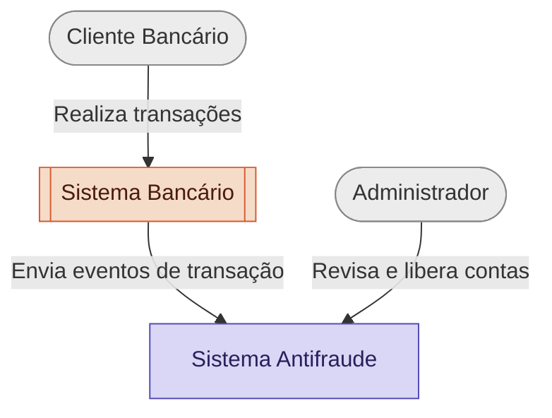
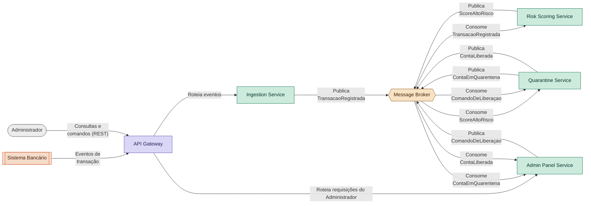

# POC 2 — Antifraude Mínimo Viável

Projeto Final de Engenharia de Sistemas Distribuídos (2026.1) — Documentação Inicial (Projeto 02).

## Sobre o Projeto

Nosso sistema antifraude é um **motor de detecção de fraude** no contexto de sistemas bancários.

O **Sistema Antifraude** analisa transações financeiras em tempo real, calcula um **risk score** baseado nos dados de cada movimentação bancária e aplica **quarentena automática** a contas suspeitas, com revisão humana disponível via Painel Admin.

O sistema é construído como um conjunto de microsserviços, aplicando padrões consagrados de arquitetura distribuída para lidar com escrita/leitura em alto volume, consistência entre serviços e resiliência a falhas.

---

## Arquitetura

### Diagrama C4 — Nível 1 (Contexto)



O Cliente Bancário não interage diretamente com o Sistema Antifraude — os dados de suas transações, capturados pelo Sistema Bancário, são o principal insumo analisado pelo motor de risk scoring.

### Diagrama C4 — Nível 2 (Containers)



| Microsserviço | Responsabilidade |
|---|---|
| **API Gateway** | Ponto único de entrada para requisições externas e mensagens para fora do sistema |
| **Ingestion Service** | Recebe os eventos brutos de transação vindos do Sistema Bancário (tipo, valor, conta de origem, conta de destino, marco temporal) e os valida/traduz para o modelo de domínio interno antes de publicá-los |
| **Risk Scoring Service** | Consome os eventos de transação e calcula o risk score multifatorial (tipo de transação, valor, padrão temporal, correlação entre contas) |
| **Quarantine Service** | Escuta scores de risco alto, aplica a quarentena automática com base no threshold configurado, e gerencia o ciclo de vida da quarentena (aplicar/liberar) |
| **Admin Panel Service** | Backend que serve o Painel Admin: expõe os casos suspeitos/em quarentena para revisão humana e envia comandos de liberação manual |
| **Message Broker** | Infraestrutura de mensageria (não é um microsserviço de negócio, é a peça que viabiliza a comunicação assíncrona entre os serviços acima) |

Cada microsserviço de domínio possui **seu próprio banco de dados** (Database-per-service).

---

## Padrões Arquiteturais Aplicados

| Padrão | Onde se aplica | Motivação |
|---|---|---|
| **Event Sourcing** | Risk Scoring Service, Ingestion Service e Quarantine Service | Guarda o histórico completo de eventos (não apenas o estado atual), possibilitando **auditoria total** de como cada score e cada decisão de quarentena foi alcançado — essencial para um sistema antifraude, que precisa justificar decisões perante uma conta que as conteste |
| **CQRS** | Risk Scoring Service | Separa o modelo de escrita (eventos brutos de transação) do modelo de leitura (score pré-calculado), já que os dois têm padrões de acesso muito diferentes |
| **SAGA (Choreography)** | Risk Scoring → Quarantine → Admin Panel | Coordena a cadeia "score alto → aplicar quarentena → notificar admin" através de eventos encadeados, sem necessidade de um orquestrador central dado o tamanho reduzido da cadeia |
| **Anti-corruption Layer** | Ingestion Service | Traduz o formato externo de transações do Sistema Bancário (colunas `step`, `type`, `amount`, `nameOrig`, `nameDest`) para o modelo de domínio interno, isolando o sistema de mudanças no contrato externo |

---

## Decisões Arquiteturais (ADRs)

### ADR 001 — Escolha do Message Broker

**Status:** Aceito

**Contexto:** O Sistema Antifraude depende de comunicação assíncrona entre os microsserviços para propagar eventos (`TransacaoRegistrada`, `ScoreAltoRisco`, `ContaEmQuarentena`), seguindo o estilo de **SAGA via Choreography** adotado para coordenar a resposta a um caso de fraude. É necessária uma ferramenta de mensageria com suporte a publish/subscribe, simples de configurar via Docker Compose e sem exigir conhecimento prévio que o grupo não teria tempo hábil de adquirir durante o projeto.

**Decisão:** RabbitMQ como message broker para toda a comunicação assíncrona entre os microsserviços.

**Alternativas consideradas:**
- *Kafka* — mais robusto para altíssimo volume e retenção longa de eventos (o que combinaria bem com Event Sourcing), mas descartado por exigir uma curva de configuração e operação desproporcional ao escopo de uma POC acadêmica.
- *Redis Pub/Sub* — mais leve, porém sem garantia de entrega (mensagens publicadas sem consumidor conectado são perdidas), inaceitável para eventos críticos como a aplicação de quarentena.

**Consequências:**
- Não oferece replay de eventos de longo prazo nativamente como o Kafka — se necessário, isso dependeria do Event Store (PostgreSQL), não do broker.

---

### ADR 002 — Persistência de Dados por Microsserviço

**Status:** Aceito

**Contexto:** Cada microsserviço precisa de armazenamento próprio (Database-per-service). É preciso decidir se cada serviço usa uma tecnologia de banco diferente (polyglot persistence) ou se o grupo padroniza uma única tecnologia. Além disso, o Risk Scoring Service, Ingestion Service e Quarantine Service adotam **Event Sourcing** — o histórico de eventos é a fonte da verdade, não apenas o estado atual — justamente para permitir **auditoria completa** de como cada score e cada decisão de quarentena foram calculados, um requisito importante em qualquer sistema antifraude que precise justificar suas decisões.

**Decisão:** PostgreSQL como banco de dados em todos os microsserviços (leitura e escrita), com uma instância própria por serviço — nunca compartilhada entre eles.

**Alternativas consideradas:**
- *Polyglot persistence completo* (uma tecnologia diferente por serviço) — descartado nesta fase; aumentaria a curva de aprendizado do grupo sem benefício proporcional ao escopo da POC. Fica registrado como possível evolução futura (ex.: Redis como modelo de leitura do CQRS).

**Consequências:**
- Um único conjunto de conhecimento (SQL/PostgreSQL) cobre todo o sistema, facilitando a colaboração entre os desenvolvedores, mesmo trabalhando em diferentes microsserviços.

---

### ADR 003 — Base de Dados para Entrada de Dados

**Status:** Aceito

**Contexto:** Precisamos de dados que sirvam de entrada para o Sistema Antifraude. Esses dados são enviados pelo Sistema Bancário. Sendo assim, a escolha da base de dados é de extrema importância, pois sua escolha definirá o contexto no qual o sistema irá trabalhar, impactando de forma direta e em especial o Risk Scoring Service. A escolha de uma boa base de dados é essencial para que o time possa focar no desenho de uma boa arquitetura e desenvolvimento dos microsserviços, sem se preocupar com problemas relacionados à base de dados, como normalização de dados, filtragem de um número grande de colunas, remoção de linhas duplicadas ou com pouca informação, entre outros.

**Decisão:** Escolhemos a base de dados [Synthetic Financial Datasets For Fraud Detection](https://www.kaggle.com/datasets/ealaxi/paysim1?select=PS_20174392719_1491204439457_log.csv), que é uma base de dados sintética, mas que simula de forma realista transações financeiras, com um grande número de colunas e linhas. A base de dados foi escolhida por ser de fácil acesso, por ser gratuita e por ser de fácil manipulação, além de ter uma relação direta com o contexto do projeto, que é a detecção de fraudes.

Das 11 colunas originais do dataset, apenas 5 são utilizadas como entrada do sistema:
- **step** — marco da hora em que a transação ocorreu;
- **type** — tipo de movimentação bancária (`CASH-IN`, `CASH-OUT`, `DEBIT`, `PAYMENT`, `TRANSFER`);
- **amount** — valor da movimentação;
- **nameOrig** — conta de origem da movimentação;
- **nameDest** — conta de destino da movimentação.

As demais 6 colunas (incluindo `isFraud`, o rótulo original do dataset) não são utilizadas — o simulador da Plataforma Bancária envia apenas os 5 campos acima ao API Gateway, que os repassa ao Ingestion Service.

**Alternativas consideradas:**
- *Base com dados do jogo PUBG* — a base, que se encontra [aqui](https://www.kaggle.com/code/atharvparbalkar/cheater-detection-pubg/input?select=train_V2.csv), apesar de ter muitos dados e colunas com fácil interpretação, foi descartada por não ter uma relação direta com o contexto do projeto. Dessa forma, provavelmente o grupo gastaria um tempo significativo para transformá-la em algo que fosse mais útil ao nosso objetivo e escopo.

**Consequências:**
- Temos uma base de dados que simula de forma realista transações financeiras, com um grande número de linhas e atributos simples, que nos permite focar no desenho de uma boa arquitetura e desenvolvimento dos microsserviços, sem se preocupar com problemas relacionados à base de dados.
- Por usarmos apenas 5 das 11 colunas, o Ingestion Service atua como o ponto que filtra e valida esses campos antes de publicá-los internamente — colunas fora dessas 5 são simplesmente ignoradas na fonte (não retransmitidas pelo simulador), então essa filtragem já ocorre antes de chegar ao Ingestion.
- O fator de risco "correlação entre contas" (do risk score multifatorial) é bem suportado por esse dataset, já que `nameOrig` e `nameDest` permitem identificar cadeias de transferência entre as mesmas contas. Já o fator "device fingerprint", pensado no escopo original do projeto, não tem correspondência nas colunas disponíveis e fica descartado do risk score nesta POC.

---

### ADR 004 — Sistema de Detecção Out-of-Band, sem Autoridade de Bloqueio Síncrono

**Status:** Aceito

**Contexto:** O simulador da Plataforma Bancária faz o replay das linhas do dataset PaySim de forma sequencial e espaçada no tempo, reproduzindo um fluxo contínuo de eventos como se fossem transações acontecendo ao vivo — o que justifica plenamente a arquitetura de microsserviços orientada a eventos (Event Sourcing, CQRS, SAGA), já que o pipeline reage evento a evento, com necessidade real de resiliência e auditabilidade a cada passo.

Isso, no entanto, levanta uma questão separada: o Sistema Antifraude deveria ter autoridade para bloquear uma transação em andamento (exigindo uma chamada síncrona de ida e volta com o Sistema Bancário) ou deveria atuar apenas como um sistema de detecção que sinaliza e quarentena contas com base em padrões observados ao longo do tempo? Essas são duas perguntas independentes — a primeira (fonte de dados via replay) já está resolvida; esta ADR trata da segunda (natureza da resposta do sistema).

O Risk Score depende fortemente do fator "correlação entre contas" (cadeias de transferência via `nameOrig`/`nameDest`), que só é identificável observando **múltiplas transações ao longo do tempo** — não é possível reconhecer esse padrão a partir de uma única transação isolada.

**Decisão:** O Sistema Antifraude opera como um sistema de **detecção out-of-band** (fora do caminho crítico da transação), nunca bloqueando uma transação em andamento nem se comunicando de volta com o Sistema Bancário para aprová-la ou rejeitá-la. A avaliação de risco resulta em dois registros internos, ambos assíncronos e sem retorno ao Sistema Bancário:
- Por **transação**: um rótulo interno (`TransacaoAprovada` / `TransacaoRejeitada`) atribuído após o processamento do evento.
- Por **conta**: quando transações rejeitadas se acumulam em um padrão (não uma ocorrência isolada), a conta é colocada em quarentena — um estado interno do Quarantine Service, consultado pelo Risk Scoring Service para tratar com suspeita elevada quaisquer eventos futuros daquela mesma conta.

**Alternativas consideradas:**
- *Bloqueio síncrono real* (o Sistema Bancário aguarda uma resposta do Antifraude antes de concluir a transação) — descartado. Exigiria uma cadeia de chamadas síncronas e bloqueantes entre API Gateway, Ingestion Service e Risk Scoring Service, contradizendo o desacoplamento pretendido pela SAGA via Choreography já adotada.
- *Bloqueio em tempo real por regra simples de transação* (ex.: valor acima de um limite) — descartado. O Risk Score de é centrado em padrão acumulado entre contas, que só se revela observando uma sequência de transações; um bloqueio isolado por regra simples não tira proveito dos padrões que o sistema foi desenhado para detectar.

**Consequências:**
- Positivas: mantém a arquitetura desacoplada da SAGA via Choreography, sem introduzir um caminho crítico síncrono; alinhado com o funcionamento de sistemas antifraude reais voltados à detecção de padrões acumulados (ex.: lavagem de dinheiro), que tipicamente operam em paralelo ao sistema de pagamentos, não como um gateway de autorização.
- Negativas: o sistema não impede, no momento em que ocorre, que uma transação fraudulenta se complete — a "rejeição" é sempre um registro/rótulo interno pós-processamento, não uma ação real de bloqueio sobre o Sistema Bancário.

---

## Stack Tecnológico

| Camada | Escolha | Justificativa |
|---|---|---|
| **Linguagem / Framework** | Python + FastAPI | Assíncrono nativo, gera documentação OpenAPI automaticamente, curva de aprendizado baixa |
| **Banco de Dados** (leitura e escrita) | PostgreSQL | Ver [ADR 002](#adr-002--persistência-de-dados-por-microsserviço) |
| **Message Broker** | RabbitMQ | Ver [ADR 001](#adr-001--escolha-do-message-broker) |
| **Orquestração local** | Docker Compose | Sobe todos os microsserviços, bancos e broker com um único comando |
| **CI** | GitHub Actions | Lint, testes e build da imagem Docker a cada push/PR, nativo do GitHub |

---

## Ferramentas de IA Utilizadas

| Ferramenta | Onde atuou | Como foi orientada | Avaliação honesta |
|---|---|---|---|
| Claude (Anthropic) | Discussão de arquitetura, diagramas C4, redação de ADRs, montagem dos slides de apresentação | Perguntas incrementais do grupo sobre cada padrão/decisão, com contexto do documento do professor fornecido | Muito útil para aprender o conteúdo, mas é necessário utilizar _esforço de raciocínio_ nível _Médio_ ou maior, além de iterar continuamente, pois normalmente detalhes importantes para o entendimento e motivação dos padrões e diagramas ficam de fora na primeira iteração |
| Claude (Anthropic) | Criação da primeira versão dos slides de apresentação | Dividir os slides em ordem lógica para facilitar a apresentação, além de dividir as partes que cada integrante deveria apresentar e quanto tempo utilizar em cada uma | Também muito útil, pois os slides são organizados, concisos e abordam o conteúdo necessário. Porém, é melhor usá-lo apenas para gerar a primeira versão, pois essa funcionalidade consome muito recurso, reduzindo o crédito para consultas posteriores |
| Claude (Anthropic) | Escrita de documentação | Escrever os documentos, à exemplo deste README, seguindo as diretrizes especificadas, como: ordem das seções, nível de detalhamento, conformidade com o projeto | Muito útil para criar documentação coerente e bem estruturada. Contudo, à medida que as modificações em partes do projeto são decididas e feitas manualmente, fora do escopo da ferramenta, inconsistências vão sendo introduzidas, necessitando constante atualização da ferramenta para mitigar esses erros, além de sempre revisar cuidadosamente o conteúdo gerado |
| GitHub Copilot | Implementação da camada de CI básica | Propor e estruturar um workflow inicial no GitHub Actions para validar o projeto com lint, testes automatizados e build das imagens Docker em cada push/PR | Foi muito boa para acelerar a automação do fluxo de qualidade do repositório, especialmente em um projeto com múltiplos serviços, mas ainda será preciso revisar os passos à medida que o projeto evolui, a fim de garantir que ela esteja funcional para o contexto real do ambiente e do projeto |
| Claude (Anthropic), ChatGPT, GitHub Copilot | Desenvolvimento do código para os microsserviços | Após discutida a arquitetura e decidida a base de dados e o contexto no qual o sistema estaria insetido, foi requisitado à IA que criasse os códigos e organização interna das pastas de cada microsserviço | Poucos erros foram cometidos pelas IAs. Os principais dizem respeito ao fato de que as bibliotecas do código vinham com versões desatualizadas, além de criarem poucos testes para o sistema. No fim, teriam sido muito mais eficientes se tivéssemos trabalhado melhor em uma documentação coerente e suficientemente robusta, como exposto em maior detalhes na seção de _Lições Aprendidas_, logo abaixo |


## Lições Aprendidas

**Contratos entre microsserviços deveriam ter sido documentados antes da
implementação, não descobertos durante ela.**

O C4 de Nível 2 definiu claramente **quais** eventos cada serviço publica e
consome (`TransacaoRegistrada`, `ScoreAltoRisco`, `ContaEmQuarentena`,
`ComandoDeLiberacao`, `ContaLiberada`). O que não foi documentado com o
mesmo rigor foi o **formato exato** de cada evento (nomes de campo, tipos,
routing keys do RabbitMQ) nem o comportamento esperado de cada serviço ao
processá-los (idempotência, o que fazer em caso de falha parcial, ordem de
operações).

Como o Ingestion Service, o Risk Scoring Service e a dupla Admin
Panel/Quarantine Service foram implementados em branches paralelas, sem esse
contrato fixado, a integração revelou diversos desalinhamentos que só
apareceram ao testar os serviços conversando de verdade:

- Uma fila do RabbitMQ nomeada a partir de quem a declarou primeiro
  (`ingestion.transacao-registrada`), e não do evento que carregava —
  confuso assim que um consumidor de verdade passou a existir.
- O Risk Scoring Service publicando na routing key do Admin Panel
  diretamente, pulando o Quarantine Service no meio da cadeia — o C4
  já definia esse salto como incorreto, mas a implementação divergiu.
- Um evento nomeado `ScoreAltoRisco` sendo rejeitado por um consumidor que
  esperava `ContaEmQuarentena` — dois nomes de evento consecutivos na
  cadeia, fáceis de confundir ao implementar cada ponta isoladamente.
- Um consumidor inteiro (o que aplica quarentena a partir do score do Risk
  Scoring Service) documentado no README de um serviço como parte do fluxo,
  mas nunca implementado — só percebido ao testar a integração de ponta a
  ponta, não durante a revisão de código de cada serviço isoladamente.

Nenhum desses problemas era complexo de resolver individualmente — mas
juntos, tomaram uma quantidade de tempo desproporcional ao final do projeto,
justamente na integração, quando o prazo já estava mais apertado. Se o
formato de cada evento (um "contrato" por routing key, com um exemplo de
payload e as regras de idempotência) tivesse sido fixado e documentado antes
de cada dupla começar a implementar seu serviço, a integração teria sido
quase mecânica — conectar peças já compatíveis — em vez de um processo de
descoberta e correção sob pressão de tempo.

Isso também limitou o quanto o trabalho pôde ser paralelizado de verdade: em
teoria, os 5 microsserviços poderiam ter sido desenvolvidos totalmente em
paralelo por pessoas diferentes; na prática, a falta de um contrato
compartilhado significou que boa parte do trabalho de "integração" só podia
começar depois que os serviços já existiam, em vez de acontecer junto com a
implementação de cada um.

---

## Como Executar

### Pré-requisitos

- Docker e Docker Compose v2 (`docker compose version` deve funcionar).
- O dataset PaySim baixado do Kaggle
  ([link](https://www.kaggle.com/datasets/ealaxi/paysim1/data)), colocado em
  **dois** locais (cada um alimenta uma parte diferente do sistema):
  - `simulator/data/PS_20174392719_1491204439457_log.csv` — usado pelo Simulador.
  - `risk-scoring-service/ml/data/PS_20174392719_1491204439457_log.csv` — usado
    para treinar o modelo de risco.
- O modelo de fraude treinado (gera o arquivo usado pelo Risk Scoring Service
  em tempo real):
```bash
  cd risk-scoring-service
  python3 -m ml.train
  cd ..
```
  Isso lê ~6,3 milhões de linhas e pode levar alguns minutos.

### Subindo o sistema completo

Na raiz do repositório:

```bash
docker compose up --build
```

Isso sobe os 5 microsserviços de negócio (`api-gateway`, `ingestion-service`,
`risk-scoring-service`, `quarantine-service`, `admin-panel-service`), 4 bancos
PostgreSQL (um por serviço com estado) e o RabbitMQ. O `simulator` fica de
fora do `up` por padrão (ver abaixo).

Portas expostas no host:

| Serviço | Porta | Doc interativa |
|---|---|---|
| API Gateway | `8080` | `http://localhost:8080/docs` |
| Ingestion Service | `8001` | `http://localhost:8001/docs` |
| Risk Scoring Service | `8002` | `http://localhost:8002/docs` |
| Quarantine Service | `8003` | `http://localhost:8003/docs` |
| Admin Panel Service | `8004` | `http://localhost:8004/docs` |
| RabbitMQ Management UI | `15672` | usuário/senha: `antifraud`/`antifraud` |

### Enviando transações (Simulador)

Em outro terminal, com o sistema já no ar:

```bash
cd simulator
API_GATEWAY_URL=http://localhost:8080 python3 main.py --count 5
```

O Simulador lê a PaySim **sequencialmente** (preserva a correlação temporal
entre contas — ver `simulator/README.md`) e envia cada transação ao API
Gateway. `--count N` envia N transações e encerra; sem essa flag, roda
continuamente. `--dry-run` imprime o evento sem enviar, útil para inspecionar
o formato sem depender do resto do sistema estar de pé.

### Interpretando os logs

Uma transação percorre a cadeia inteira de microsserviços, e cada etapa deixa
um rastro no terminal do `docker compose up`. Uma transação normal (score
baixo) para por aqui:

- api-gateway | POST /events/transactions -> 202
- ingestion-service | POST /internal/transactions -> 202
- risk-scoring-service | Evento ... pontuado: p_fraud=0.0367 (origin=..., destination=...)


Uma transação de **alto risco** (score acima do threshold) continua a cadeia:

- risk-scoring-service | Evento de risco alto publicado para conta C... com score 0.31...
- quarantine-service | Quarentena aplicada para C...
- admin-panel-service | Evento ContaEmQuarentena processado para a conta C...

Essa diferença — a cadeia parar no Risk Scoring vs. continuar até o Admin
Panel — é a melhor forma de demonstrar visualmente o critério de decisão do
sistema (ver `HIGH_RISK_THRESHOLD` abaixo).

### Forçando um caso de alto risco (útil para demonstração)

Como o threshold padrão (`0.5`) é raramente atingido em transações
aleatórias da PaySim, para garantir um caso de quarentena visível numa
demonstração, sobrescreva o threshold antes de subir o
`risk-scoring-service`:

```yaml
# docker-compose.yml, dentro de risk-scoring-service -> environment:
HIGH_RISK_THRESHOLD: "0"
```

Com isso, **qualquer** transação dispara o fluxo completo até o Admin Panel.
Reverta antes de qualquer commit — um threshold de `0` não é um valor de
produção válido, ele marcaria toda transação como suspeita.

### Inspecionando o estado manualmente

```bash
# Casos em quarentena, via API (mesmo caminho que o Administrador usaria)
curl http://localhost:8080/admin/cases

# Risk score incremental de uma conta específica
curl http://localhost:8002/accounts/<ACCOUNT_ID>

# Direto no banco de um serviço (troque o nome do serviço/banco/tabela)
docker compose exec ingestion-db psql -U ingestion -d ingestion_db -c "SELECT * FROM events;"
docker compose exec risk-scoring-db psql -U risk_scoring -d risk_scoring_db -c "SELECT * FROM account_stats;"
```

No RabbitMQ Management UI (`http://localhost:15672`), a aba **Queues** mostra
as filas (`transacoes.registradas`, `quarantine.score-alto-risco`,
`quarantine.comando-liberacao`, entre outras) e permite inspecionar mensagens
manualmente em **Get messages**.

### Encerrando

```bash
docker compose down
```

## Testes Automatizados

O projeto usa duas ferramentas complementares, com propósitos diferentes:

- **`pytest`** roda os **testes automatizados** — verifica se o
  **comportamento** do código está correto (ex.: "um evento válido é
  persistido e publicado", "um evento duplicado não é processado duas
  vezes", "uma transação de alto risco aciona a quarentena"). Testa lógica,
  não estilo.
- **`ruff`** é um **linter** — verifica a **qualidade/consistência do
  código** (imports não utilizados, linhas longas demais, formatação,
  convenções modernas do Python). Não sabe se o código faz a coisa certa,
  só se está bem escrito.

Ambos rodam a partir da raiz do repositório, e cobrem os 5 microsserviços de
uma vez (cada um mantém sua própria suíte, agregada em `tests/`):

```bash
python3 -m venv .venv
source .venv/bin/activate
pip install -r requirements-dev.txt

pytest -q          # roda todos os testes
ruff check .        # verifica o estilo de todo o repositório
```

Os testes usam implementações **em memória** no lugar de PostgreSQL/RabbitMQ
reais (ex.: `InMemoryEventStore`, `InMemoryEventPublisher`) — por isso rodam
em menos de 2 segundos, sem precisar do Docker Compose no ar. Isso também
permite testar cenários difíceis de provocar manualmente contra
infraestrutura real, como "o que acontece se a publicação no RabbitMQ
falhar depois do evento já ter sido persistido" (ver
`tests/test_ingestion_service.py`).

`tests/test_feature_parity.py` merece nota à parte: compara a
reimplementação das features do Risk Scoring Service (calculada uma
transação por vez, em produção) com o pipeline de treino do modelo (que
processa o CSV inteiro em lote) — garantindo que os dois caminhos produzem
exatamente o mesmo resultado, e pegando automaticamente qualquer divergência
futura entre eles.